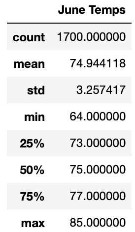
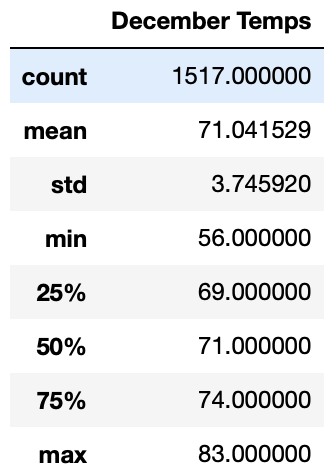
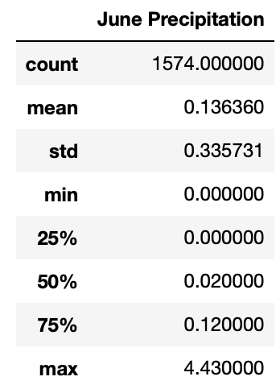
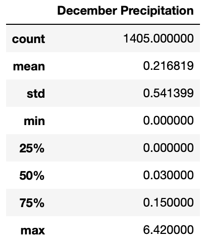

# Surfs Up

## Description
In this project we investigate temperature data on the island of Oahu for the months of June and December.

## Resources and Data

### Resources
- Python v3.7.13
- Pandas v1.3.5
- SQLAlchemy v1.4.39

### Data Source
- [hawaii.sqlite](hawaii.sqlite)

### Analysis File
- [SurfsUp_Challenge.ipynb](SurfsUp_Challenge.ipynb)

## Analysis

### June Summary Statistics



### December Sumary Statistics



### June vs December
As can be see above there are several differences between the June and December summary statistics. These include

- The mean and median temperature in June is ~ 4°F higher than in December.
- The Range of temperatures for June is 13°F vs 18°F in December.
- The standard deviation in December is ~0.25°F higher than June.

### Additional Weather Data
There are two queries that can be run to get additional weather data for the months of June and December. Specifically we will look at precipitation.

#### June Precipitation Query and Analysis
```
# Get precipitation summary statistics for June
june_prcp = session.query(Measurement.prcp).\
    filter(func.strftime("%m",Measurement.date) == "06").all()

# Convert to list
june_prcp_list = [x for y in june_prcp for x in y]

# Convert to df
june_prcp_df = pd.DataFrame(data=june_prcp_list,columns=['June Precipitation'])
june_prcp_df.describe()
```
This gives us the following:



#### December Precipitation Query and Analysis
```
# Get precipitation summary statistics for December
dec_prcp = session.query(Measurement.prcp).\
    filter(func.strftime("%m",Measurement.date) == "12").all()

# Convert to list
dec_prcp_list = [x for y in dec_prcp for x in y]

# Convert to df
dec_prcp_df = pd.DataFrame(data=dec_prcp_list,columns=['December Precipitation'])
dec_prcp_df.describe()
```

This gives us the following:



As can be seen, with the exception of the max precipitation for each month (and subsequently the standard deviation), there is little difference between June and December regarding precipitation.